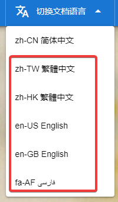
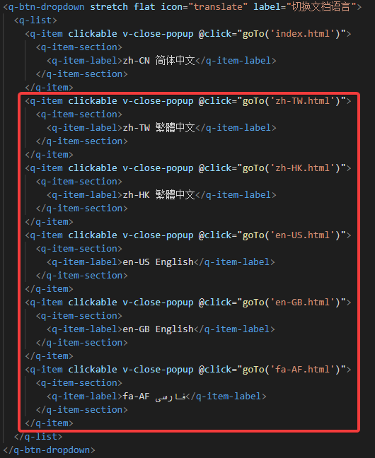

# octave_libbpf

Write and run **eBPF programs from GNU Octave**.

`octave_libbpf` is a GNU Octave package that wraps
[libbpf](https://github.com/libbpf/libbpf), the reference userspace library for
eBPF, and adds a small eBPF toolchain written in Octave m-code.  Together they
let you author, assemble, load, attach, inspect and drive eBPF programs from the
Octave prompt — including writing the eBPF program itself in Octave, without a C
compiler and without clang.

```octave
pkg load octave_libbpf

R = bpf.regs ();
b = bpf.Builder ('GPL');
counts = b.map ('counts', 'array', 'u32', 'u64', 8);

p = b.program ('kprobe/do_sys_openat2', 'count_open');
p.st_w (R.R10, -4, 0);                              % u32 key = 0
p.ld_map_fd (R.R1, 'counts');                       % r1 = &counts
p.mov64_reg (R.R2, R.R10);                          % r2 = &key
p.add64_imm (R.R2, -4);
p.call (bpf.helper ('map_lookup_elem'));
p.jeq_imm (R.R0, 0, 'done');
p.mov64_imm (R.R1, 1);
p.atomic_dw (R.R0, R.R1, 0, bpf.atomic_op ('add'));
p.label ('done');
p.mov64_imm (R.R0, 0);
p.exit ();

obj = b.build ();            % assemble, encode BTF, write an ELF image
obj.load ();                 % let libbpf verify and load it
obj.attach_all ();           % attach the kprobe

obj.find_map ('counts').lookup (0)
```

## What it provides

| Layer | Contents |
| --- | --- |
| **Authoring** | `bpf.Builder`, `bpf.Asm`, `bpf.Insn`, `bpf.MapDef`, `bpf.Elf`, `bpf.BtfBuilder` — an eBPF assembler plus BTF and ELF64/BPF writers, all in m-code |
| **Object model** | `bpf.Object`, `bpf.Program`, `bpf.Map`, `bpf.Link`, `bpf.RingBuf`, `bpf.PerfBuf`, `bpf.BTF` |
| **Binding** | the `libbpf_wrap` oct-file: 180+ entry points covering objects, programs and the whole attach family, maps, links, ring/perf buffers, BTF and the low level `bpf_*()` syscall wrappers |
| **Helpers** | type/helper/enumeration tables (`bpf.map_type`, `bpf.prog_type`, `bpf.helper`, …), byte conversion, probing, logging |

## Documentation

Check out document: [octave_libbpf Document](https://cnoctave.github.io/octave_libbpf/index.html)
* `docs/index.html` — the Chinese documentation site (open it in a browser):
  installation, dependencies, a full API reference for every `bpf.*` class and
  function, worked examples, implementation notes and the test suite.
* `doc/design.md` — design notes for people extending the package.
* `help octave_libbpf` and `help bpf.<Class>` from inside Octave.

## Requirements

* GNU Octave ≥ 8 (developed and tested against 10.3)
* the libbpf shared library (`libbpf.so.1` or `libbpf.so`)
  * Fedora/RHEL: `dnf install libbpf`
  * Debian/Ubuntu: `apt install libbpf1` (or `libbpf-dev` for the headers)
* a C++ compiler for `mkoctfile`
* **optional**: `/usr/include/bpf` (the `libbpf-devel` package).  When it is
  missing the package builds against the public libbpf headers bundled in
  `src/vendor/bpf`, so only the runtime library is required.
* to *load and attach* eBPF programs you need `CAP_BPF` (or `CAP_SYS_ADMIN` on
  kernels before 5.8).  Assembling, BTF/ELF generation and all type tables work
  without any privileges.

## Installation

```sh
octave --eval "pkg install octave_libbpf-0.1.0.tar.gz"
octave --eval "pkg load octave_libbpf; demo_octave_libbpf"
```

To build from a checkout without installing:

```octave
addpath ('octave_libbpf/src');
addpath ('octave_libbpf/inst');
```

The build system finds libbpf automatically: it prefers a `libbpf/` source tree
next to the package, then `/usr/include/bpf`, then the bundled headers, and
links against `libbpf.so` or the versioned `libbpf.so.1`.  Override with
`make -C src LIBBPF_ROOT=... LIBBPF_LIBS=...`.

## How an Octave program becomes an eBPF program

1. `bpf.Asm` encodes each instruction with `bpf.Insn`, resolving symbolic
   branch labels and recording map references.
2. `bpf.BtfBuilder` encodes the BTF that describes every map: the modern
   `struct { __uint(type, …); __type(key, …); }` form, including the VAR and
   DATASEC records that libbpf walks.
3. `bpf.Elf` lays out an ELF64 relocatable object for `EM_BPF`: program
   sections, `.maps`, `license`, `.BTF`, a symbol table and one `SHT_REL`
   section per program that references a map.
4. `bpf.Object.from_mem` hands the image to `bpf_object__open_mem()`; from
   there libbpf does exactly what it does for a clang produced `.bpf.o`.

Objects produced by clang work too — see `examples/clang_object.m`.

## Examples

| File | What it shows |
| --- | --- |
| `examples/hello_kprobe.m` | a kprobe counter written in Octave, read back from a map |
| `examples/ringbuf_tracepoint.m` | a raw tracepoint streaming events through a BPF ring buffer |
| `examples/test_run.m` | socket filter and XDP programs executed with `BPF_PROG_TEST_RUN` |
| `examples/map_from_octave.m` | creating, filling, iterating and freezing maps from Octave |
| `examples/clang_object.m` | loading a `.bpf.o` compiled by clang |

Run them with `run('examples/hello_kprobe.m')` or simply `demo_octave_libbpf`.

## Testing

```octave
pkg load octave_libbpf
pkg test octave_libbpf
```

The suite covers instruction encoding, BTF and ELF generation, the mnemonic
tables and — when the process is allowed to use eBPF — live map, program load
and `BPF_PROG_TEST_RUN` round trips.

## Layout

```
octave_libbpf/
├── DESCRIPTION, INDEX, NEWS, COPYING
├── src/
│   ├── Makefile            libbpf detection and mkoctfile driver
│   ├── libbpf_wrap.cc      the oct-file binding to libbpf
│   ├── tools/              generators for the helper/enum tables and Asm.m
│   └── vendor/             bundled public libbpf + Linux UAPI headers
├── inst/
│   ├── +bpf/               the Octave facing API
│   ├── tests/              BIST tests
│   └── demo_octave_libbpf.m
├── examples/
└── doc/
```

## License

BSD-2-Clause.  Files under `src/vendor/` keep their original licenses (libbpf:
LGPL-2.1-only OR BSD-2-Clause, Linux UAPI: GPL-2.0 WITH Linux-syscall-note).

## How to translate octave_libbpf Document into another language
In ./docs directory, index.html is zh-CN simplified Chinese document.
For example, if you want to translate document into English.
1. Copy index.html as another document with different language code as filename,
   for example, en-US.html.
2. Translate en-US.html into English.
3. Add dropdown like the picture below to every *.html.
   For example, add dropdown "en-US English".
   
   The code for adding dropdown is like the picture below.
   
4. PR to octave_libbpf.

